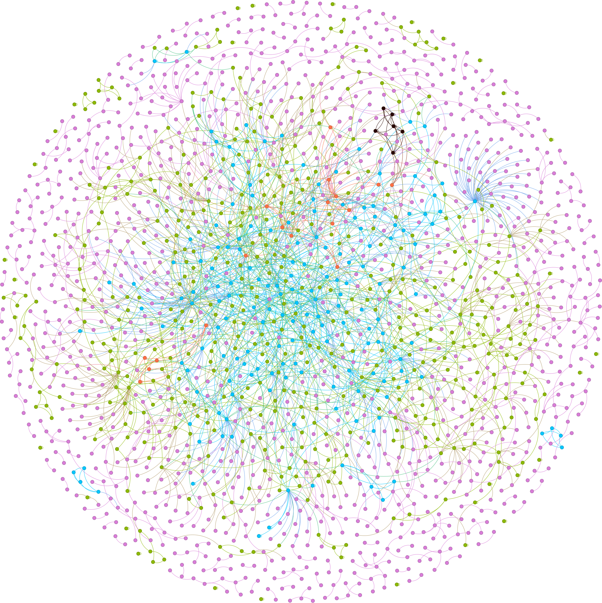

# Graphs mining

## Task

This small application looks for communities on undirected, single-layer, unweighted graphs. Each community is supposed to represent a dense subgraph that provides a high-level representation of the whole network.
In this study, communities are modeled as:
* Connected components of the k-core. An implementation of Batagelj, Zaversnik algorithm that computes k-cores in $O(m)$ time is provided (where $m$ is the number of the edges of the graph).
* Denser subgraphs. The densest subgraph is found in polynomial time by Goldberg's algorithm. 

## Dataset 

Case study 1:
[Dolphins](http://konect.cc/networks/dolphins/),
[Zebra](http://konect.cc/networks/moreno_zebra/)

Case study 2:
[Yeast protein](http://konect.cc/networks/moreno_propro)

## Case study 1

A preliminary study regards a small community of 28 zebras and 62 bottlenose dolphins.

|                          |     dolphins    |      zebras       |
| ------------------------ | --------------- | ----------------- | 
| coreness                 |      k=5        |      k=12         | 
| n. of individuals k-core |       36        |      13           | 
| n. of individuals DSD    |       44        |      14           | 

In both cases, the densest community includes roughly half of the total population. The densest subgraph and the community with the highest core are shown below. Zebras seem to form a very dense community with strong interactions, suggested by the high level of coreness.

|                          |     Densest Subgraph Discovery                  |       k-core                                        |
| ------------------------ | ----------------------------------------------- | --------------------------------------------------- | 
| dolphins                 |            |              | 
| zebras                   |        |          | 

## Case study 2

This undirected network contains protein interactions contained in yeast. A node represents a protein and an edge represents a metabolic interaction between two proteins. 

|                          |     Densest Subgraph Discovery                  |       k-core                                        |
| ------------------------ | ----------------------------------------------- | --------------------------------------------------- | 
|  yeast proteins          |                 |                | 

 Research showed that proteins with a high degree were more important for the surivial of the yeast than others.
