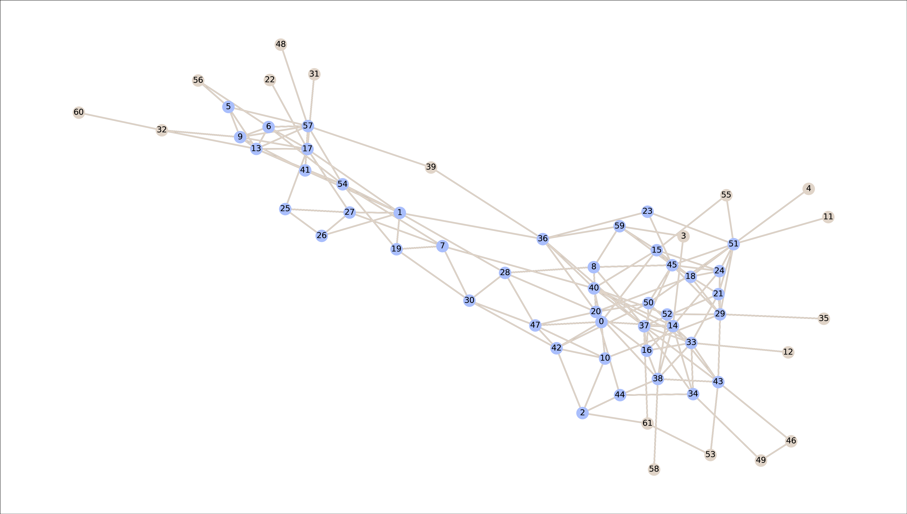
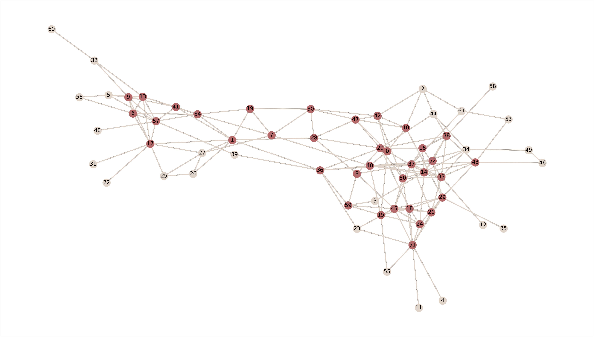
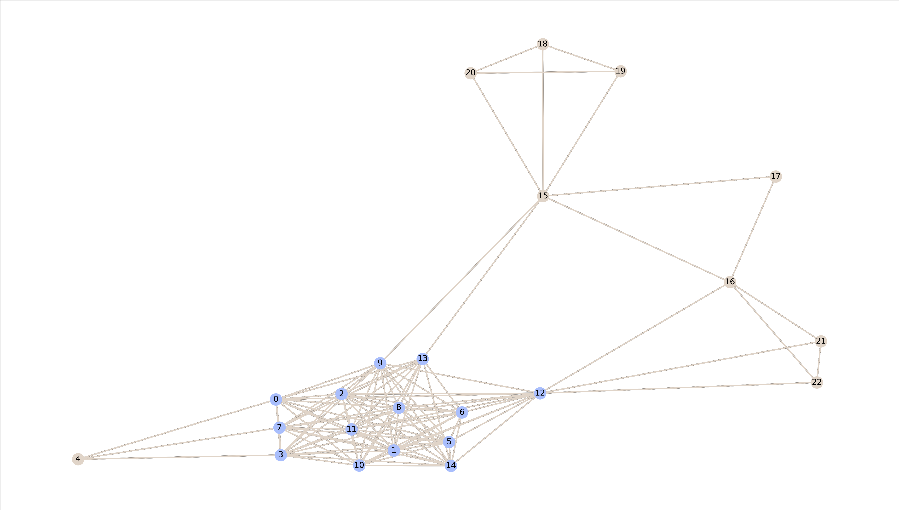
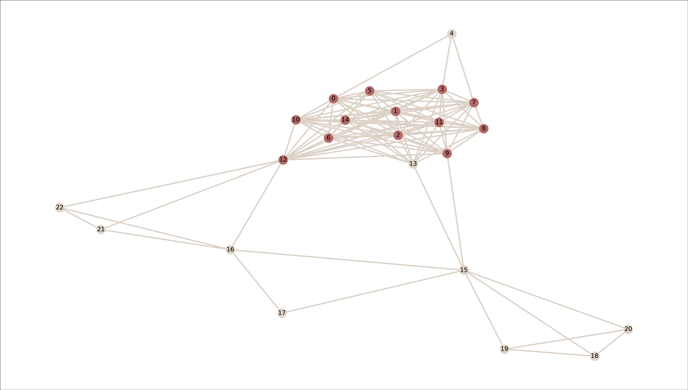
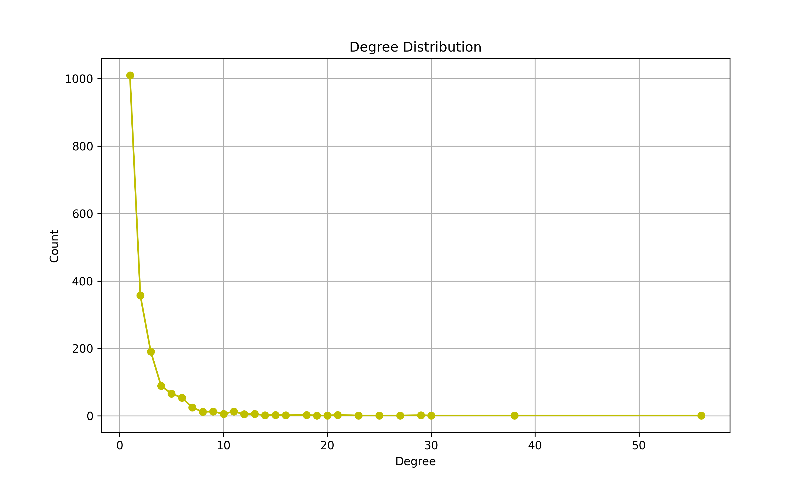
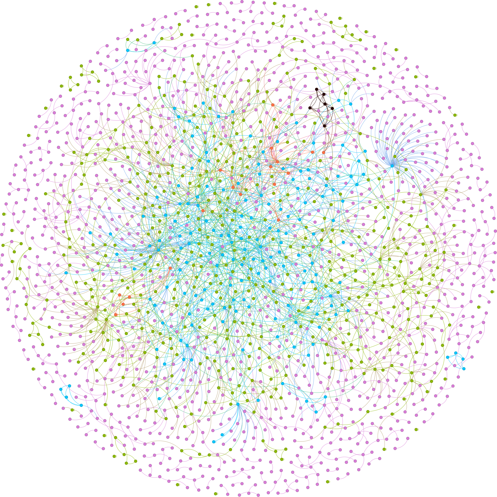
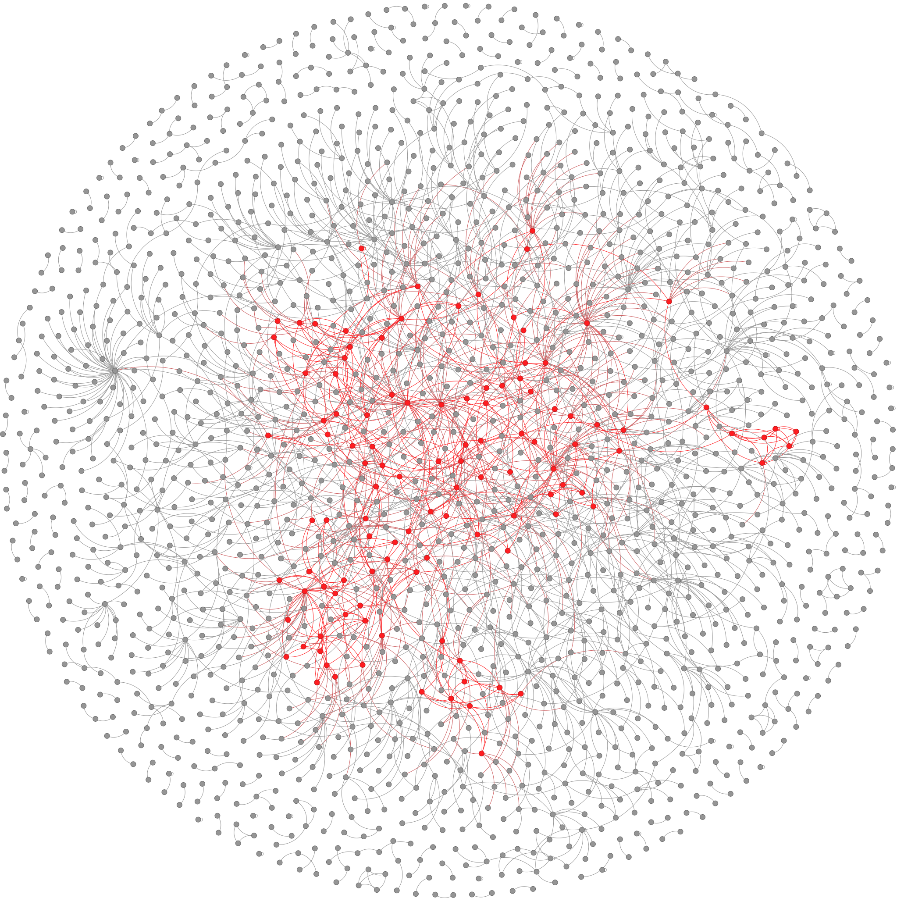

# Graphs mining

This small application looks for communities on undirected, single-layer, unweighted graphs. Each community is supposed to represent a dense subgraph that provides a high-level representation of the whole network.
In this study, communities are modeled as:
* Connected components of the k-core. An implementation of Batagelj, Zaversnik algorithm that computes k-cores in $O(m)$ time is provided (where $m$ is the number of the edges of the graph).
* Denser subgraphs. The densest subgraph is found in polynomial time by Goldberg's algorithm. 

### Dataset 

Case study 1:
* [Dolphins](http://konect.cc/networks/dolphins/)
* [Zebra](http://konect.cc/networks/moreno_zebra/)

Case study 2:
* [Yeast protein](http://konect.cc/networks/moreno_propro)

# Case study 1

A preliminary study regards a small community of 28 zebras and 62 bottlenose dolphins. A node represents a zebra (or a dolphin) and an edge shows that there was an interaction between two zebras (or two dolphins) during the study.

|                          |     dolphins    |      zebras       |
| ------------------------ | --------------- | ----------------- | 
| coreness                 |      k=5        |     k=12          | 
| n. of individuals k-core |    36/62        |    13/28          | 
| n. of individuals DSD    |    44/62        |    14/28          | 

Analyzing the densest communities found by the DSD and kcore algorithms, it is possible to see that:
* In both cases, the densest community accounts for about half of the population. 
* Zebras appear to form a very dense community with strong interactions, achieving a high level of coreness.

|                          |     Densest Subgraph Discovery                  |       k-core                                        |
| ------------------------ | ----------------------------------------------- | --------------------------------------------------- | 
| dolphins                 |            |              | 
| zebras                   |        |          | 

# Case study 2

This network contains protein interactions contained in yeast. A node represents a protein and an edge represents a metabolic interaction between two of them.  

Research showed that proteins with a high degree were more important for the surivial of the yeast than others. Looking at the degree distribution it is possible to see that a node can reach even a degree around 50!

 <!--    -->

 

However, there are few proteins with such a large number of interactions. For this reason the coreness remains low with only a few elements reaching k = 6. The densest subgraph is located in the 4-5-6-cores and reveals the cohesion between 114 proteins (out of 1.870).

 ### K-core 

Coreness legend:
* 🟪 k=2
* 🟩 k=3
* 🟦 k=4
* 🟧 k=5
* ⬛️ k=6

    

### Densest Subgraph Discovery    

* 🟥 if belongs to the densest subgraph

  

