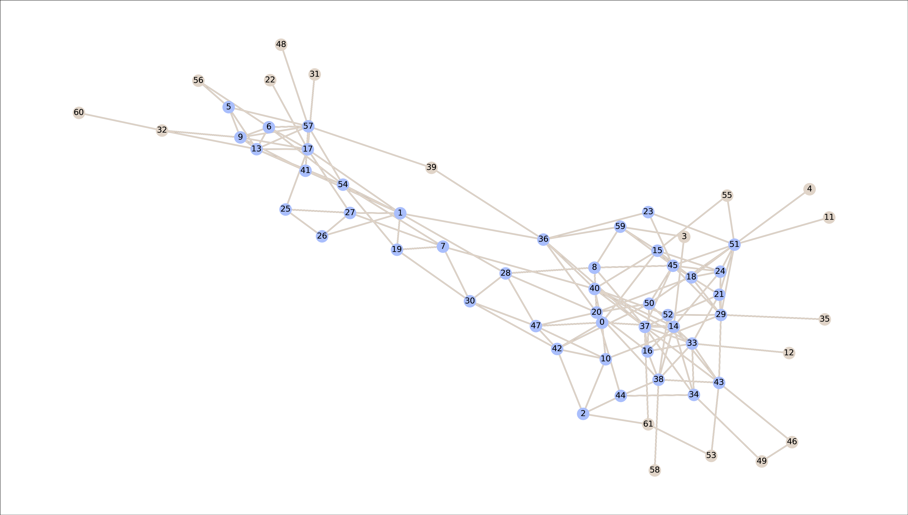
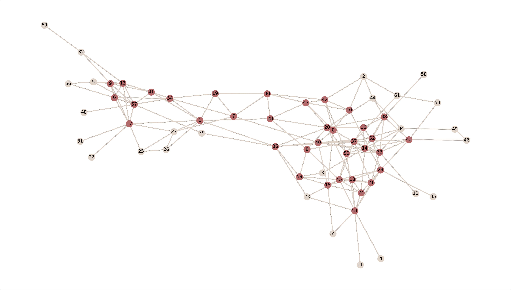
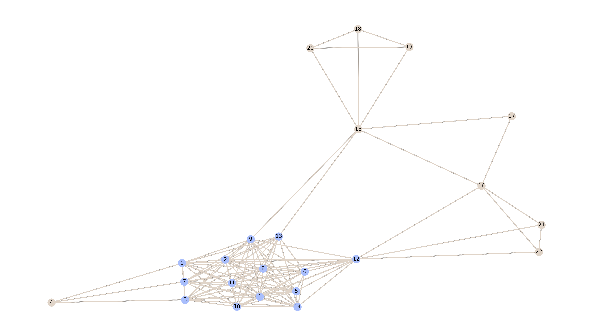
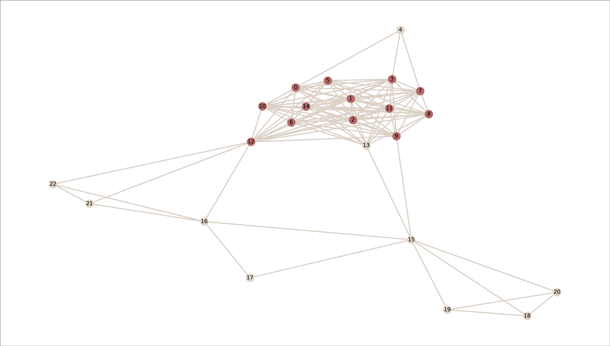

# Graphs mining

## Task

This small application looks for communities on undirected, single-layer, unweighted graphs. Each community is supposed to represent a dense subgraph that provides a high-level representation of the whole network.
In this study, communities are modeled as:
* Connected components of the k-core. An implementation of Batagelj, Zaversnik algorithm that computes k-cores in $O(m)$ time (where m is the number of the edges of the graph) is provided.
* Denser subgraphs. The densest subgraph is found in polynomial time by Goldberg's algorithm. 

## Dataset 

Case study 1:
[Dolphins](http://konect.cc/networks/dolphins/)
[Zebra](http://konect.cc/networks/moreno_zebra/)

Case study 2:
[Zebra](http://konect.cc/networks/dimacs10-netscience)

## Case study 1

A preliminary study regards a small community of 28 zebras and 62 bottlenose dolphins.

|                          |     dolphins    |      zebras       |
| ------------------------ | --------------- | ----------------- | 
| coreness                 |      k=5        |      k=12         | 
| n. of individuals k-core |       36        |      13           | 
| n. of individuals DSD    |       44        |      14           | 

In both cases, the densest community is representative of the behavior of half of the individuals. The study of coreness and the discovery of the densest subgraph lead to similar results, although DSD seems less restrictive than kcore.

Solarized dark                            |  Solarized Ocean
:----------------------------------------:|:-------------------------------------------:
     |  
:----------------------------------------:|:-------------------------------------------:
 | 

## Case study 2

